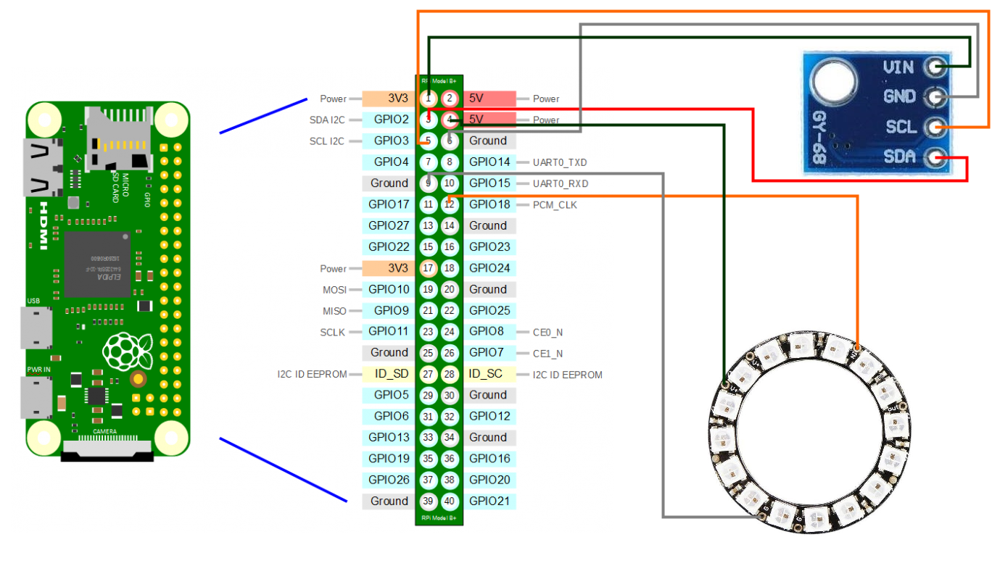
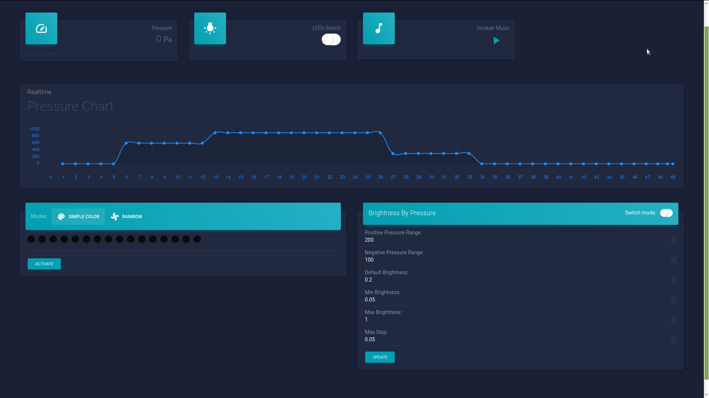

# BubLight
Light up your hookah with a neopixel ring!

Get some **RaspberryPi**, connect the **neopixel LED ring** and the **BMP180 pressure sensor** to it,
upload and start **BubLight** `.jar` file and you are ready to go!
You can then connect to a **BubLight** web thingy, where you can **configure colors** and
modes and see some **nice graph** showing **realtime pressure**!

## NOTE
This **hobby project** is still **WORK IN PROGRESS** and it does not have any release yet.
However, it had some successful demos :).

## Build and start in simulated mode
Hardware parts (the LED ring and the pressure sensor) are simulated in the simulated mode.

Steps:
1. Clone and build BubLight repository. Go to the directory where you want to clone BubLight and execute:
    ```
    git clone https://github.com/Pyro2266/bublight.git
    cd bublight
    mvn clean install -P build-web
    ```

2. Go to the backend target directory: `cd lighty-backend/target`

3. Start `.jar` file in a simulated mode with command: `java -jar bublight-backend-0.0.2-SNAPSHOT.jar --bublight.simulatedMode=true`.

4. WebUI and REST endpoints are now available on `localhost` at port `8080`.

5. Go to the WebUI (`localhost:8080`) and click things or play with Postman collection from the `docs` directory.

6. Enjoy! But keep in mind that everything is still under development and all the risk is on you :).

7. Feel free to leave feedback, create a PR, or an issue if something is not working.

## Connection schema
Components used in demo:
- Raspberry Zero W 1.1
- GY-68 (BMP180)
- Adafruit Neopixel Ring (16x LED)



## Build and start on Raspberry from scratch
1. Download and install [Raspberry Pi Imager](https://www.raspberrypi.org/software/)

2. Choose Raspberry Pi OS LITE and write it to the SD card (I'm using `Raspbian GNU/Linux 10 (buster)`).

3. To automatically connect to your Wi-Fi network (original guide [here](https://core-electronics.com.au/tutorials/raspberry-pi-zerow-headless-wifi-setup.html)) go to the SD card (`boot` partition) and create file `wpa_supplicant.conf` in the root directory.

4. Open `wpa_supplicant.conf` file and write there configuration of your Wi-Fi (including `country`):
    ```
    country=SK
    ctrl_interface=DIR=/var/run/wpa_supplicant GROUP=netdev
    update_config=1
    network={
    	ssid="MyWiFiNetwork"
    	psk="aVeryStrongPassword"
    	key_mgmt=WPA-PSK
    }
    ```

5. (Optional) It is possible to include multiple networks. For example I'm using Wi-Fi network I have at home and hotspot from my phone. Just include another `network` block under the first one:
    ```
    network={
    	ssid="MyWiFiNetwork1"
    	psk="aVeryStrongPassword"
    	key_mgmt=WPA-PSK
    }
   
    network={
    	ssid="MyWiFiNetwork2"
    	psk="aVeryStrongPassword"
    	key_mgmt=WPA-PSK
    }
    ```

6. Enable SSH by creating empty file called `ssh` (without and file extension) in the SD card (the same place as Wi-Fi was configured).

7. Insert SD card into your Raspberry, power it up, wait a few seconds. Now find the IP address of your Raspberry in the network (I'm using android app called [Fing](https://play.google.com/store/apps/details?id=com.overlook.android.fing)).

8. With the address obtained in previous step you can connect via SSH to the Raspberry. Default credentials are username: `pi` and password: `raspberry`. Example `ssh` command: `ssh pi@192.168.1.123`.

9. With the SSH connectiou up update and install following tools: `i2c-tools`, `wiringpi`, `swig`, `java 8` (unfortunately `java 11` does not work with Raspberry Zero):
    ```
    sudo apt-get update
    sudo apt-get install i2c-tools wiringpi swig openjdk-8-jre
    ```

10. Check if `java 8` is installed: `java -version`. You should see `openjdk version "1.8.0_212"`.

11. To enable `I2C` (original [guide](https://learn.adafruit.com/adafruits-raspberry-pi-lesson-4-gpio-setup/configuring-i2c)) and setup locale:
    1. Execute command `sudo raspi-config`.
    2. Go to `Interface Options`.
    3. Go to `I2C` and enable it.
    4. Go into `Localisation Options` and setup locale.

12. Check if `I2C` is ready with command: `sudo i2cdetect -y 1`. It should return:
    ```
         0  1  2  3  4  5  6  7  8  9  a  b  c  d  e  f
    00:          -- -- -- -- -- -- -- -- -- -- -- -- -- 
    10: -- -- -- -- -- -- -- -- -- -- -- -- -- -- -- -- 
    20: -- -- -- -- -- -- -- -- -- -- -- -- -- -- -- -- 
    30: -- -- -- -- -- -- -- -- -- -- -- -- -- -- -- -- 
    40: -- -- -- -- -- -- -- -- -- -- -- -- -- -- -- -- 
    50: -- -- -- -- -- -- -- -- -- -- -- -- -- -- -- -- 
    60: -- -- -- -- -- -- -- -- -- -- -- -- -- -- -- -- 
    70: -- -- -- -- -- -- -- 77
    ```

13. Check if locale are correct with command: `locale`.

14. Create `~/bublight` directory with command: `mkdir ~/bublight`. We will copy the application here.

15. Clone and build BubLight repository on your local computer (preferably in another console while keeping the SSH connection to the RPi open). Go to the directory where you want to clone BubLight and execute:
    ```
    git clone https://github.com/Pyro2266/bublight.git
    cd bublight
    mvn clean install -P build-web
    ```

16. Copy executable `jar` file (from `bublight-backend/target` directory) and application properties (from `bublight-backend/src/main/resources` directory) to the Raspberry (into the `~/bublight` directory). Don't forget to update your IP address.
   ```
   scp bublight-backend/target/bublight-backend-0.0.2-SNAPSHOT.jar pi@192.168.1.123:~/bublight
   scp bublight-backend/src/main/resources/application.properties pi@192.168.1.123:~/bublight
   ```

17. Go back to the SSH session to Raspberry and go to the `bublight` directory we created before: `cd ~/bublight`.

18. Check application properties if everything is set up correctly (if simulated mode is turned off and number of LEDs is correct): `nano application.properties`.

19. Start BubLight with command: `sudo java -jar bublight-backend-0.0.2-SNAPSHOT.jar`. It takes a minute or two to start the application.

20. WebUI and REST endpoints are now available at port `8080`.

21. Go to the WebUI (`IP_OF_YOUR_RPI:8080`) and click things or play with Postman collection from the `docs` directory.

22. Enjoy! But keep in mind that everything is still under development and all the risk is on you :).

23. Feel free to leave feedback, create a PR, or an issue if something is not working.

## Screenshot
To give an idea how does it look now (keep in mind that it's still under development).

